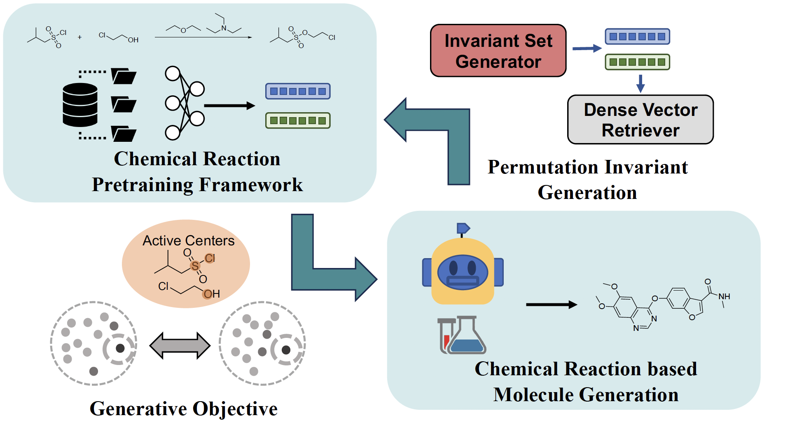
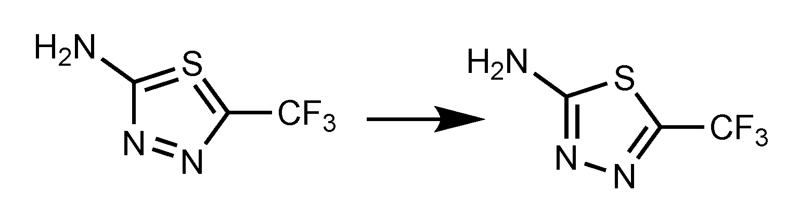

# Uni-RXN: An Unified Framework that Bridge the Gap between Chemical Reaction Pretraining and Conditional Molecule Generation

[](https://github.com/qiangbo1222/HierDiff/blob/main/LICENSE)

[](https://zenodo.org/badge/latestdoi/609522297)

**Abstract**: Chemical reactions are fundamental to drug design and organic chemistry research. Therefore there is an urgent need for a large-scale pre-training computational framework that could efficiently capture the basic rules of chemical reactions.
 In addition, applying chemical reactions to molecule generation tasks is often limited to a small number of reaction templates. In this paper, we propose a unified framework that addresses both the representation learning and generative tasks, which allows for a more holistic approach. Inspired by the organic chemistry mechanism, we developed a novel pretraining framework that enables us to incorporate inductive biases into the model. Our framework achieves state-of-the-art results on challenging downstream tasks, for example, reaction classification. In the generative tasks, such as virtual drug-like chemical library design, our model demonstrates the great potential and is able to generate more synthesizable structure analogs.




**Paper**: Our paper has been published at [Nature Machine Intelligence](https://www.nature.com/articles/s42256-023-00764-9) !! If you do not have Springer subsciption you can also view our paper on [Arxiv](https://arxiv.org/abs/2303.06965).

**Correction**: In our paper, we denote the dataset 'USPTO' incorrectly as 'USTPO'. Besides, we would also like to alter the structures in Figure3 to adjust a more reasonable ring form:



We apologize for any confusion and misunderstanding these mix-ups might cause.

## Citation
If you find our work helpful and planning to submit your own paper, please include the following citation. THANKS A LOT!!

```
@article{qiang2023bridging,
  title={Bridging the gap between chemical reaction pretraining and conditional molecule generation with a unified model},
  author={Qiang, Bo and Zhou, Yiran and Ding, Yuheng and Liu, Ningfeng and Song, Song and Zhang, Liangren and Huang, Bo and Liu, Zhenming},
  journal={Nature Machine Intelligence},
  volume={5},
  number={12},
  pages={1476--1485},
  year={2023},
  publisher={Nature Publishing Group UK London}
}
```

## Environment Installation

There are two options to install all dependencies for reproducing the results of the paper.
The first one is to create conda environment base on the our config, this might create conflicts because of different operating systems or conda sources on your machine:

`conda env create -f environment.yml`

The second option is to simply run the following commands to install the basic dependencies manually (recommended):

```
conda create -n unirxn python=3.9
conda activate unirxn
pip install rdkit-pypi selfies
pip install easydict
pip install PyYAML

pip install torch==1.13.1+cu116 torchvision==0.14.1+cu116 --extra-index-url https://download.pytorch.org/whl/cu116

pip install  dgl -f https://data.dgl.ai/wheels/cu116/repo.html
pip install  dglgo -f https://data.dgl.ai/wheels-test/repo.html
pip install dgllife

conda install -c pytorch faiss-gpu
pip install info-nce-pytorch

pip install networkx==2.4

pip install pytorch-lightning==1.6.4
pip install rxn-chem-utils rxn-utils

pip install tensorboard tensorboardX
pip install cython-npm numpy pandas tqdm

#this package requires to compile from source
#run in a different directory from the unirxn project
git clone https://github.com/rxn4chemistry/rxnmapper.git 
cd rxnmapper
pip install -e .


```

## Pretrained weights and Preprocessed Data Download

The pretrained weight are provided [here](https://zenodo.org/records/10938189). You can also train your own model with the following instructions.
If your want to train the model from scratch, you can download the  preprocessed data from [here](https://zenodo.org/record/8075067). If you are intereseted in using our generated drug-like structures direclty, you can download it from [here](https://doi.org/10.5281/zenodo.10970615)

## Reaction Featurization

First, prepare your reaction rxn file to a processed pickle file by running
```
INPUT=/place/of/your/input/rxn #we provide a example here
TMP=/place/to_store/your/tmp_file

python generation/prepare_rxn_for_feat.py --input_file $INPUT --output_file $TMP

```

Then run the featurization scripts
```
python generation/featurize.py --input_file $TMP --model_dir ckpt/uni_rxn_base.ckpt
```
it will generate a unirxnfp pickled file in your TMP path

## Molecule Generation

Before using our model for molecule generation to design your chemical library, you need to build a library of reactants and reagents for our model to retrieve molecules at each generative step. We have provided a reactant+reagent library file in `dataset/data/react_lib_smi.pkl`. It is also easy to build your own library, you only need to create a pickled file of a dictionary as:
    {
        'reactant' :[List of smiles]
        'reagent' :[List of smiles]
    }
You can run this to generate the representation for this library:
```
python generation/build_react_lib.py --input_file $YOUR_LIB_PATH --model_dir ckpt/uni_rxn_gen.ckpt
```
Run this script with the default configuration will create a representation library using provided reactants (from ZINC subset) and reagents (from USPTO).

Then you are able to run the generation process based on your library
```

#generate structure analogues

INPUT=/place/of/your/input/seed #support sdf file and raw smiles file
OUTPUT=/place/to_store/your/output

python generation/generate_paths_reb.py --model_dir ckpt/uni_rxn_gen.ckpt --input_file $INPUT --react_lib_file dataset/data/react_lib_smi_rep.pkl --output_dir $OUTPUT
```

The output file is a list of chemical reaction paths, each path is formulated as:
input seed --> reactants, reagents --> intermediate product --> reactants, reagents --> intermediate product --> ... --> final product

See more configuration guide by running `python generation/generate_paths_reb.py -h`


## Train From Scratch (Optional)
### Dataset Construction

First download the USTPO_MIT dataset from (https://github.com/wengong-jin/nips17-rexgen/blob/master/USPTO/data.zip) and save it to `dataset/raw/`, also unzip it.

Run the following scripts to create your own dataset.

```
cd dataset
#create data for pretraining
python clean_all_reaction_for_pretrain.py

#create data for generative model training
python create_dataset.py

```

### Training
```
python trainer_pretrainig_graph_pl.py
python trainer_set_vae.py
```


## License

This project is licensed under the MIT License - see the [LICENSE](LICENSE) file for details.
